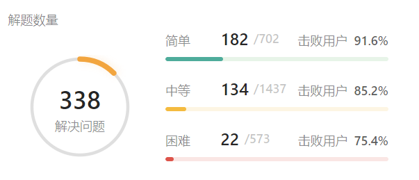

# [Home](../README.md)
# [LeetCode](https://leetcode-cn.com/)

## easy
- [ [20] 有效的括号 ](./leetcode/easy/20.md)
- [ [169] 多数元素 ](./leetcode/easy/169.md)
- [ [509] 斐波那契数 ](./leetcode/easy/509.md)

## medium
- [ [3] 无重复字符的最长子串 ](./leetcode/medium/3.md)
- [ [36] 有效的数独 ](./leetcode/medium/36.md)
- [ [48] 旋转图像 ](./leetcode/medium/48.md)
- [ [71] 简化路径 ](./leetcode/medium/71.md)
- [ [79] 单词搜索 ](./leetcode/medium/79.md)
- [ [150] 逆波兰表达式求值 ](./leetcode/medium/150.md)
- [ [223] 矩形面积 ](./leetcode/medium/223.md)
- [ [289] 生命游戏 ](./leetcode/medium/289.md)
- [ [443] 压缩字符串 ](./leetcode/medium/443.md)
- [ [503] 下一个更大元素Ⅱ ](./leetcode/medium/503.md)
- [ [529] 扫雷游戏 ](./leetcode/medium/529.md)
- [ [814] 二叉树剪枝 ](./leetcode/medium/814.md)
- [ [1091] 二进制矩阵中的最短路径 ](./leetcode/medium/1091.md)
- [ [1138] 字母板上的路径 ](./leetcode/medium/1138.md)
- [ [2100] 适合打劫银行的日子 ](./leetcode/medium/2100.md)

## hard
- [ [4] 寻找两个正序数组的中位数 ](./leetcode/hard/4.md)
- [ [23] 合并K个升序链表 ](./leetcode/hard/23.md)
- [ [25] K个一组翻转链表 ](./leetcode/hard/25.md)
- [ [32] 最长有效括号 ](./leetcode/hard/32.md)
- [ [37] 解数独 ](./leetcode/hard/37.md)
- [ [41] 缺失的第一个正数 ](./leetcode/hard/41.md)
- [ [42] 接雨水 ](./leetcode/hard/42.md)
- [ [51] N皇后 ](./leetcode/hard/51.md)
- [ [52] N皇后II ](./leetcode/hard/52.md)
- [ [212] 单词搜索II ](./leetcode/hard/212.md)
- [ [224] 基本计算器 ](./leetcode/hard/224.md)
- [ [233] 数字1的个数 ](./leetcode/hard/233.md)
- [ [239] 滑动窗口最大值 ](./leetcode/hard/239.md)
- [ [315] 计算右侧小于当前元素的个数 ](./leetcode/hard/315.md)

