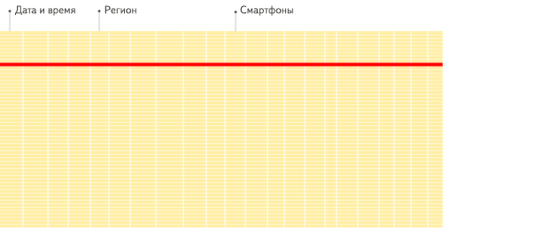

# [Home](../README.md)
# [clickhouse](https://clickhouse.tech/docs/zh/)


## 部署clickhouse
### 配置host
```shell
	vim /etc/hosts
	192.168.56.* clickhouse1
	192.168.56.* clickhouse2
```
### 安装
```shell
	rpm -ivh *.rpm
```
### 配置
```shell
	passwd clichouse
	usermod -s /bin/bash clickhouse
	mkdir -p /home/clickhouse
	chown clickhouse:clickhouse /home/clickhouse
	id clickhouse
	usermod -d /home/clickhouse
	mkdir -p /home/clickhouse/data
	mkdir -p /home/clickhouse/log/clickhouse-server
	chown -R clickhouse:clickhouse /home/clickhouse
	chmod 755 /home/clickhouse
```
```shell
	vim /etc/clickhouse-server/config.xml
```
```xml
	<cluster_myclickhouse>
	    <shard>
	        <replica>
	            <host>clickhouse1</host>
	            <port>9000</port>
	        </replica>
	    </shard>
	    <shard>
	        <replica>
	            <host>clickhouse2</host>
	            <port>9000</port>
	        </replica>
	    </shard>
	</cluster_myclickhouse>
```
### 启动、停止、重启
```shell
	/etc/init.d/clickhouse-server start/stop/restart
```
## 基本应用
### 建表
```sql
	CREATE TABLE IF NOT EXISTS dbName.tbName_local (
		field1	String	comment '',
		field2	String	comment ''
	)ENGINE = MERGETREE()
	ORDER BY (field1) SETINGS index_granularity = 8192;

	-- 建分布式表
	CREATE TABLE IF NOT EXISTS dbName.tbName_all as dbName.tbName_local
	ENGINE = Distributed(ClusterName, dbName, dbName_local, hiveHash(field1));
```
### 数据类型
- 整型
	- 有符号整型（-2n-1~2n-1-1）：
		- Int8 - [-128 : 127]
		- Int16 - [-32768 : 32767]
		- Int32 - [-2147483648 : 2147483647]
		- Int64 - [-9223372036854775808 : 9223372036854775807]
	- 无符号整型范围（0~2n-1）：
		- UInt8 - [0 : 255]
		- UInt16 - [0 : 65535]
		- UInt32 - [0 : 4294967295]
		- UInt64 - [0 : 18446744073709551615]

- 浮点型
	- Float32 - float
	- Float64 – double

- 布尔型
	- 没有单独的类型来存储布尔值。可以使用 UInt8 类型，取值限制为 0 或 1。

- 字符串
	- 变长字符串 String
	- 定长字符串 FixedString(N)

- 枚举类型
	- Enum8 用 'String'= Int8 对描述。
	- Enum16 用 'String'= Int16 对描述。

- 数据组 Array(T)

- 元组 Tuple(T1, T2, ...)

- 日期  Date

- 时间戳 DateTime

### clickhouse常用函数
	rand() 生产随机数
	toString() 转字符串
	toInt8(), toInt16(), toInt32(), toInt64() 转整数
	substring() 字符串截取
