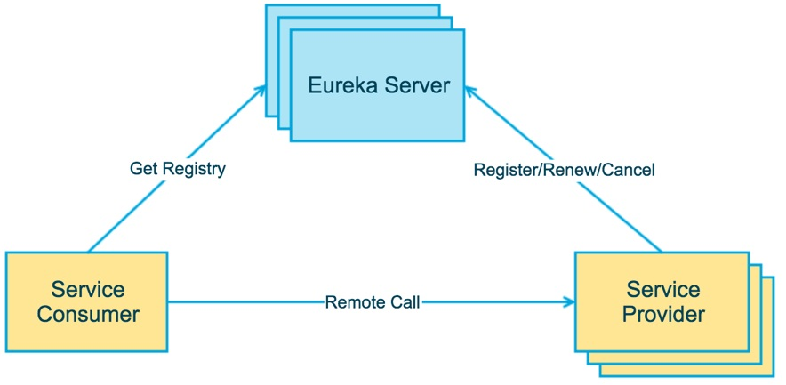
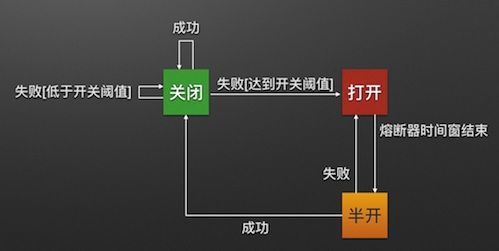

# [Home](../README.md)
## [Spring Cloud](https://spring.io/projects/spring-cloud) / [中文文档](https://www.springcloud.cc/) / [实操案例](https://github.com/H-f-society/spring-cloud)

### 注册中心 Eureka


- Eureka SErver
	- 提供服务注册和发现
- Service Provider
	- 服务提供方
	- 将自身服务注册到Eureka, 从而使服务消费方能够找到
- Service Consumer
	- 服务消费方
	- 从Eureka获取注册服务列表, 从而能够消费

- 配置

```
# 是否将自己注册到Eureka Server, 默认为true
eureka.client.register-with-eureka=false

# 是否从Eureka Server获取注册信息, 默认为true
eureka.client.fetch-registry=false

#logging.level.com.netflix.eureka=OFF
#logging.level.com.netflix.discovery=OFF

# 设置与Eureka Server交互的地址, 查询服务和注册服务都需要依赖这个地址
# 默认是http://localhost:8761/eureka ；多个地址可使用","分隔
eureka.client.serviceUrl.defaultZone=http://localhost:8081/eureka/
```
- 启动类

```java
@SpringBootApplication
@EnableEurekaServer
public class EurekaServerNode1Application {

	public static void main(String[] args) {
		SpringApplication.run(EurekaServerNode1Application.class, args);
	}

}
```
### 服务提供、调用
#### producer
- 依赖

```xml
<dependencies>
	<dependency>
		<groupId>org.springframework.cloud</groupId>
		<artifactId>spring-cloud-starter-eureka</artifactId>
	</dependency>
	<dependency>
		<groupId>org.springframework.boot</groupId>
		<artifactId>spring-boot-starter-test</artifactId>
		<scope>test</scope>
	</dependency>
</dependencies>
```
- 配置

```
spring.application.name=spring-cloud-producer
server.port=9000
eureka.client.serviceUrl.defaultZone=http://localhost:8000/eureka/
```
- 启动类

```java
@SpringBootApplication
// 启动服务注册与发现
@EnableDiscoveryClient
public class ServerProducerApplication {

	public static void main(String[] args) {
		SpringApplication.run(ServerProducerApplication.class, args);
	}

}
```
- controller

```java
@Controller
public class TestController {

	@RequestMapping("/hello")
	@ResponseBody
	public String index(@RequestParam String name) {
		return "hello " + name + ", this is first message";
	}
}
```
#### consumer
- 依赖

```xml
<dependencies>
	<dependency>
		<groupId>org.springframework.cloud</groupId>
		<artifactId>spring-cloud-starter-eureka</artifactId>
	</dependency>
	<dependency>
		<groupId>org.springframework.boot</groupId>
		<artifactId>spring-boot-starter-test</artifactId>
		<scope>test</scope>
	</dependency>
</dependencies>
```
- 配置

```
spring.application.name=spring-cloud-consumer
server.port=9001
eureka.client.serviceUrl.defaultZone=http://localhost:8080/eureka
```
- 启动类

```java
@SpringBootApplication
// 启动服务注册与发现
@EnableDiscoveryClient
// 启用feign进行远程调用
@EnableFeignClients
public class ServerConsumerApplication {

	public static void main(String[] args) {
		SpringApplication.run(ServerConsumerApplication.class, args);
	}

}
```
- controller

```java
@Controller
public class TestController {

	@Autowired
	private TestRemote testRemote;

	@RequestMapping("/hello/{name}")
	@ResponseBody
	public String index(@PathVariable("name") String name) {
		return testRemote.hello(name);
	}
}
```
- feign调用实现

```java
@FeignClient(name = "spring-cloud-producer")
public interface TestRemote {

	@RequestMapping(value = "/hello")
	public String hello(@RequestParam(value = "name") String name);
}
```
### 熔断器 Hystrix


1. 熔断器机制
	> &emsp;&emsp;当Hystrix Command请求后端服务失败数量超过一定比例(默认50%), 断路器会切换到开路状态(Open). 这时所有请求会直接失败而不会发送到后端服务. 断路器保持在开路状态一段时间后(默认5秒), 自动切换到半开路状态(HALF-OPEN). 这时会判断下一次请求的返回情况, 如果请求成功, 断路器切回闭路状态(CLOSED), 否则重新切换到开路状态(OPEN). 

	> &emsp;&emsp;Hystrix的断路器就像我们家庭电路中的保险丝, 一旦后端服务不可用, 断路器会直接切断请求链, 避免发送大量无效请求影响系统吞吐量, 并且断路器有自我检测并恢复的能力.

2. fallback
	> &emsp;&emsp;相当于是降级操作, 对于查询操作, 我们可以实现一个fallback方法, 当请求后端服务出现异常的时候, 可以使用fallback方法返回的值, fallback方法返回的值一般是设置默认或者来自缓存.

3. 资源隔离 
	> &emsp;&emsp;在hystrix中, 主要通过线程池来实现资源隔离, 通常在使用的时候我们会根据调用的远程服务划分出多个线程池. 例如调用产品服务的Command放入到A线程池, 调用账户服务的Command放入B线程池, 这样做的主要优点是运行环境被隔离了. 这样就算调用服务的代码存在bug或者由于其他原因导致自己所在的线程池被耗尽, 不会对系统的其他服务造成影响. 但是带来的代价就是维护多个线程池会对系统带来额外的开销.

	> &emsp;&emsp;如果是对性能有严格要求而且确信调用服务的客户端代码不会出问题的话, 可以使用hystrix的信号模式(Semaphores)来隔离资源. 

#### feign
- 配置

```
spring.application.name=spring-cloud-consumer-hystrix-fallback
server.port=9001
feign.hystrix.enabled=true
eureka.client.serviceUrl.defaultZone=http://localhost:8080/eureka
```
- 创建回调类

```java
@Component
public class TestRemoteHystrix implements TestRemote {

	@Override
	public String hello(@RequestParam(value = "name") String name) {
		return "hello " + name + ", this message send failed";
	}
}
```
- 添加fallback属性

```java
@FeignClient(name = "spring-cloud-producer", fallback = TestRemoteHystrix.class)
public interface TestRemote {

	@RequestMapping(value = "/hello")
	public String hello(@RequestParam(value = "name") String name);
}
```

#### dashboard
#### turbine
### rabbit
### zuul
### sleuth
### oath2