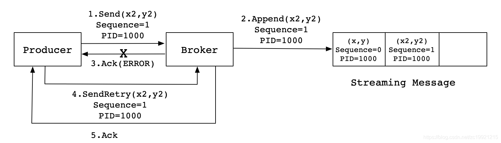

# [Home](../README.md)
## Kafka安装
### 安装jdk：
```shell
	sudo apt-get install openjdk-8-jdk
```
### 获取kafka安装包：
```shell
	wget http://mirror.bit.edu.cn/apache/kafka/2.3.1/kafka_2.11-2.3.1.tgz
```
### 解压安装包：
```shell
	tar -zxvf kafka_2.11-2.3.1.tgz
```
### 重命名：
```shell
	mv kafka_2.11-2.3.1 kafka
```
### 设置环境变量：
```shell
	vim /etc/profile
```
	export KAFKA_HOME=/opt/kafka
	export PATH=$PATH:$KAFKA_HOME/bin
### 使环境变量生效:
```shell
	source /etc/profile
```
### 先启动ZooKeeper服务:
```shell
	bin/zookeeper-server-start.sh config/zookeeper.properties
```
### 启动kafka服务:
```shell
	bin/kafka-server-start.sh config/server.properties
```
### 创建一个名为"topTest"的topic:
```shell
	bin/kafka-topics.sh --create --zookeeper localhost:2181 \
	--replication-factor 1 --partitions 1 --topic topTest
```
### 查看所包含的topic:
```shell
	bin/kafka-topics.sh --list --zookeeper localhost:2181
```
### 打开Producer（生产者）服务
```shell
	bin/kafka-console-producer.sh --broker-list localhost:9092 --topic topTest
```
### 打开Customer（消费者）服务
```shell
	bin/kafka-console-consumer.sh --bootstrap-server localhost:9092 --topic topTest --from-beginning
```

## kafka幂等性：

> 幂等，就是指多接口的多次调用所产生的结果和只调用一次是一致的。没有幂等性的情况下就会重复发送数据

- Kafka的幂等性机制能保证单个分区不会重复写入数据，而实现幂等性的核心就是引入了producer id 和 sequence number这两个概念。

- Kafka内部会自动为每个Producer分配一个producer id(PID)，broker端会为producer每个Partition维护一个<PID,Partition> -> sequence number映射。sequence number时从0开始单调递增的。

- 对于新接受到的消息，broker端会进行如下判断：

	- 如果新消息的sequence number正好是broker端维护的<PID,Partition> -> sequence number大1，说broker会接受处理这条消息。
	- 如果新消息的sequence number比broker端维护的sequence number要小，说明时重复消息，broker可以将其直接丢弃
	- 如果新消息的sequence number比broker端维护的sequence number要大过1，说明中间存在了丢数据的情况，那么会响应该情况，对应的Producer会抛出OutOfOrderSequenceException。

## kafka事务性：
- Kafka事务性主要是为了解决幂等性无法跨Partition运作的问题，事务性提供了多个Partition写入的原子性，即写入多个Partition要么全部成功，要么全部失败，不会出现部分成功部分失败这种情况。Flink正是基于Kafka的事务性，实现了端到端的Exactly Once语义 (ps： 当然FLink配合其他系统也可以实现Exactly Once语义，比如参考链接中的MySQL,我这里想说明的是source和sink都是Kafka的情况下，可以做到端到端Exactly Once)。