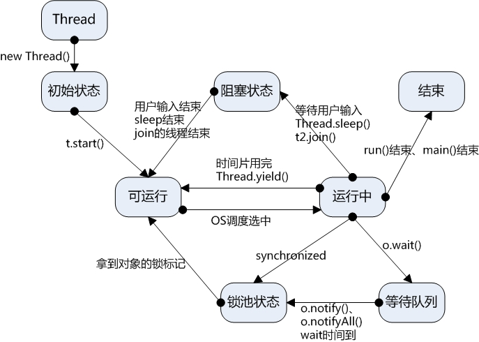

# [Home](../README.md)

## [Java](https://www.matools.com/api/java8)

### 位运算
__________________________________________________________________________________________________________________						
|  符号 |  描述  																	|  例子  						|	
| :---- | :---------------------------------------------------------------------	| :---------------------------	|						
| &     | 如果相对应位都是1，则结果为1，否则为0 									| (A＆B) 得到12，即0000 1100	|					
| \|    | 如果相对应位都是 0，则结果为 0，否则为 1 									| (A\|B) 得到61，即 0011 1101	|					
| ^     | 如果相对应位值相同，则结果为0，否则为1 									| (A^B) 得到49，即 0011 0001	|					
| ~     | 取反，即0变成1，1变成0。 													| (~A) 得到-61，即1100 0011		|				
| <<    | 左移，左操作数按位左移右操作数指定的位数。 								| (A<<2) 得到240，即 1111 0000	|					
| >>    | 右移，左操作数按位右移右操作数指定的位数。 								| (A>>2) 得到15即 1111			|			
| >>>   | 右移补零，左操作数的值按右操作数指定的位数右移，移动得到的空位以零填充。 	| (A>>>2) 得到15即0000 1111		|	

__________________________________________________________________________________________________________________				

### 基本类型
___________________________________________________________
| 名字   | 基本类型 | 大小    | 最小值 	| 最大值 | 默认值 	|
| :--	 | :--		| :--	  | :--	 	| :--	 | :--		|
| 位     | byte		| 8 bits  | -128	| 127    | 0		|
| 短整数 | short	| 16 bits | -215	| 214    | 0		|
| 整数   | int		| 32 bits | -231	| 230	 | 0		|
| 长整数 | long		| 64 bits | -263	| 262	 | 0		|
| 单精度 | float	| 32 bits | -231	| 230	 | 0		|
| 双精度 | double	| 64 bits | -263	| 262	 | 0		|
| 字符   | char		| 16 bits | 0		| 215    | null		|
| 布尔值 | boolean	| 8 bits  | true	| false  | false	|

___________________________________________________________

## 多线程


### 锁机制
#### 公平锁/非公平锁
- 公平锁是指多个线程按照申请锁的顺序来获取锁
- 非公平锁是指多线程获取锁的顺序并不是按照申请锁的顺序，有可能后申请的线程比先申请的线程优先获取锁，有可能会造成优先反转或饥饿现象

#### 可重入锁
- 又名递归锁，是指在同一个线程在外层方法获取锁的时候，在进入内部方法会自动获取锁

```java
/**
 * 因为获取了setA()的锁（方法外层的锁），
 * 此时同时调用setB()将会自动获取setB()的锁，如果不自动获取的话方法B将不会执行
 */
synchronized void setA() throws Exception {
	Thread.sleep(1000);
	setB();
}
synchronized void setB() throws Exception {
	Thread.sleep(1000);
}
```

#### 独享锁/共享锁
- 独享锁是指该锁一次只能被一个线程所持有
- 共享锁是指该锁可被多个线程所持有

#### 互斥锁/读写锁
- 是独享锁/共享锁的具体实现

#### 乐观锁/悲观锁
- 悲观锁认为数据有可能会被其他人修改，都会对其加上锁，只能单个线程执行，其余线程进入等待。
- 乐观锁认为操作不会存在并发问题，不会有其它线程对数据进行修改，因此不会上锁，例如CAS算法。

#### 分段锁
- 将数据分段上锁，例如HashTable容器在并发环境下，容器中有多把锁，每把锁用于锁容器中的一部分数据，那么多线程访问容器中不同数据段的数据时，线程之间就不会存在锁竞争，从而有效提高并发效率。ConcurrentHashTable所使用的便是分段锁

#### 偏向锁/轻量级锁/重量级锁


- 偏向锁
	- 描述：线程在大多数情况下并不存在竞争条件，使用同步会消耗性能，而偏向锁是对锁的优化，可以消除同步，提升性能。当一个线程获得锁，会将对象头的锁标志位设为01,进入偏向模式.偏向锁可以在让一个线程一直持有锁，在其他线程需要竞争锁的时候，再释放锁。
	- 优点：加锁和解锁不需要CAS操作，没有额外的性能消耗，和执行同步方法相比仅存在纳秒级的差距。
	- 缺点：若线程间存在锁竞争，会带来额外的锁撤销的消耗。
	- 场景：只有一个线程访问同步块或者同步的方法，只有一个线程进入临界区。

- 轻量级锁：volatile
	- 描述：当线程A获得偏向锁后，线程B进入竞争状态，需要获得线程A持有的锁，那么线程A撤销偏向锁，进入无锁状态。线程A和线程B交替进入临界区，偏向锁无法满足，膨胀到轻量级锁，锁标志位设为00。
	- 优点：竞争的线程不会阻塞，提高了程序的响应速度。
	- 缺点：若线程长时间竞争不到锁，自旋会消耗CPU性能。
	- 场景：线程交替执行同步块或者同步方法，追求响应时间，锁占用时间很短，多个线程交替进入临界区。

- 重量级锁：Synchronized
	- 描述：当多线程交替进入临界区，轻量级锁hold得住。但如果多个线程同时进入临界区，hold不住了，膨胀到重量级锁。
	- 优点：线程竞争不会自旋，不会消耗CPU。
	- 缺点：线程阻塞，响应时间缓慢，在多线程下，频繁的获取是释放锁，会带来巨大的性能消耗。
	- 场景：追求吞吐量，锁占用时间较长，多个线程同时进入临界区。

#### 自旋锁
- 当一个线程在获取锁的时候，如果该所已经被其它线程获取，那么该线程将循环等待，然后不断的判断该锁是否能够被成功获取，直到获取后才会退出循环。

#### Synchronized
- 使用场景

```java
// 实例方法，锁住该类的实例对象
public synchronized void method() {

}

// 静态方法，锁住该类的类对象
public static synchronized void method() {

}

// 实例对象，同步代码块，锁住该类的实例对象
synchronized (this) {

}

// class对象，同步代码块，锁住该类的类对象
synchronized (SynchronizedDemo.class) {

}

// 任意实例对象Object，同步代码块，锁住配置的实例对象，String对象所谓锁
String lock = ""; 
synchronized (lock) {

}
```

#### synchronized和volatile
- volatile关键字的本质是告诉jvm，该变量在寄存器中的值是不确定的，需要在主存中读取，而synchronized关键字是锁住当前变量，只有当前线程可以访问，其他线程等待。volatile关键字的作用：保证变量的可见性和防止指令重排序。
	- volatile只能作用于变量，而synchronized可以作用于变量、方法和代码块。
	- 多线程访问volatile不会发生阻塞，而synchronized关键字可能发生阻塞。
	- volatile能够保证数据的可见性，就是在多个线程之间是可见的，不能保证原子性，而synchronized关键字都可以保证。
	- volatile关键字主要解决的是多个线程之间的可见性，而synchronized关键字保证的是多个线程访问资源的同步性。

### Thread
```java
public class Thread1 extends Thread {
	private String name;

	public Thread1(String name) {
		this.name = name;
	}

	@Override
	public void run() {
		for (int i = 0; i < 5; i++) {
			System.out.println(name + "运行：" + i);
			try {
				sleep((int) Math.random() * 10);
			} catch (InterruptedException e) {
				e.printStackTrace();
			}
		}
	}

	public static void main(String[] args) {
		Thread1 t1 = new Thread1("A");
		Thread1 t2 = new Thread1("B");
		t1.start();
		t2.start();
	}
}
```
### Runnable
```java
public class Thread2 implements Runnable {
	private String name;

	public Thread2(String name) {
		this.name = name;
	}

	@Override
	public void run() {
		for (int i = 0; i < 5; i++) {
			System.out.println(name + "运行：" + i);
			try {
				Thread.sleep((int) Math.random() * 10);
			} catch (InterruptedException e) {
				e.printStackTrace();
			}
		}
	}

	public static void main(String[] args) {
		new Thread(new Thread2("A")).start();
		new Thread(new Thread2("B")).start();
	}
}
```
### sheep() 与 yield()
- sleep()使当前线程进入停滞状态，所以执行sleep()的线程在指定的时间内肯定不会被执行。
- yield()只是使当前线程重新回到可执行状态，所以执行yield()的线程有可能在进入到可执行状态后马上又被执行。

## 设计模式
### 单例


> 双重校验锁 DCL - double checked locking

```java
public class Singleton {
	private volatile static Singleton singleton;
	private Singleton () {}
	public static Singleton getSingleton() {
		if (singleton == null) {
			synchronized (Singleton.class) {
				if (singleton == null) {
					singleton = new Singleton();
				}
			}
		}
		return singleton;
	}
}
```
### 工厂
> 创造型模式，其在父类中提供一个创建对象的方法， 允许子类决定实例化对象的类型。
> 工厂方法模型建议使用特殊的工厂方法代替对于对象构造函数的直接调用（即使用 new 运算符）。对象任将通过new运算符创建，只是该运算符在工厂方法中条用，工厂方法返回的对象通常称为“产品”

<div align=center> 
	 
	<p>子类可以修改工厂方法返回的对象类型</p>
</div>


### 抽象

### 适配器

### 桥接

### 责任链

### 命令


### 迭代器

### 中介者

### 生成器

### 原型

### 组合

### 装饰

### 备忘录

### 观察者

### 状态

### 策略

### 外观

### 享元

### 模板方法

### 访问者

### 代理